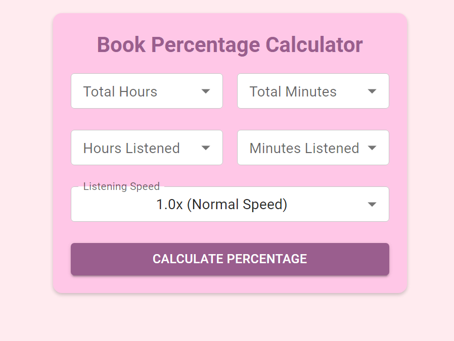

# Book Percentage Calculator

A web application to calculate the percentage of an audiobook you have listened to, along with the estimated time remaining based on your listening speed.

## Features
- Calculate the percentage of an audiobook you've listened to.
- Estimate the remaining time based on your listening speed.
- Responsive and user-friendly interface.

## Usage
1. **Open the deployed site**
   - [Audiobook Percentage Calculator](https://audiobook-percentage.web.app/)

2. **Use the Calculator**
   - Input the total hours and minutes of the audiobook.
   - Input the hours and minutes you have listened.
   - Select your listening speed.
   - Click on "Calculate Percentage" to get the result.
